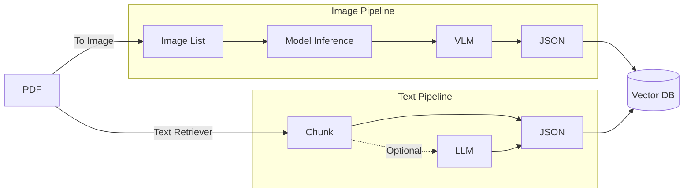

### mind map



💡本專案方法論維持，現轉移到智慧工廠之Domain
reference DEMO 老人六力衛教 chatbot : http://104.43.109.53:8060/chat

> Develop Rule👨‍💻: 先在 **開發端💻** 試架pipeline到確定"裝環境+模型設定即可開跑"，再轉移到 **算力端🖥️**跑大模型、大量實驗

---
### 825
- add TTS service 

### 824
- fix: set LLM lazy loading; instead, warm up until calling & rest after 15 mins
- connect AMD9700 with 5070, set up 'AETN' TTS service to be reachable

### 820
- sync IP-log to AMD9700
- set AMD9700 constant service
 
### 819
- add IP-log
- improve UI
- sync chat pipeline & UI to AMD9700
 
### 817
- update chat pipeline (5 VLM call ~> 2 VLM call)
- add file-upload
- 修復執行時timeout問題
- 優化前
- deployed

### 812
- (雙端)測試VLM caption的更新，同步到github
- amd速架一個對外ip
- github branch要分離出develop跟deploy；amd對外ip應該用deployed的 (那邊folder怎麼開??)
- 看一下文件，了解目前harness logic

- 同步測試SDK的實作成果

### 811
- (上傳到雲端硬碟，待處理)拍攝CMP書本(iphone拍照，VLM可以直接讀.heic?)
- ✅ 同步雙邊README，上傳github，方便未來雙邊同步
- ✅(包含於本次 caption機制 更新) 修正當前override runtime/index/ 的機制，index{time}/ 儲存每次結果 & 於.env或是serve的commands指定每次RAG的db
  - ✅(包含於本次 caption機制 更新)內部加入manual_caption_comments.md，手動審閱caption結果
- ✅caption機制更新，待測試

### 807
(prior 前~後)
- (8/11✅)修好AMD端crop失敗；model 底層去看 AMD要用RODCOM 不能用NV的torch (ultranalytics)，要裝相容版本的
- (8/11✅)前端刪除PDF按鈕，資料庫原始資料不給使用者看到(回傳的圖 除外)
- (8/11✅)圖的VLM確認，需要詳細一點 & 能retreival
- 優化retreival機制，縮短chat legacy(確認LLM冷啟動時間 & serve時每次QA的LLM是熱的還是冷的)
- 紀錄metadata(跟codex討論本系統合適的log metrics)
  ``` text
    ### 規劃加入紀錄metadata的log
    ingest mode 相關:
        - 基礎規格紀錄 : mode, .env中的相關設置, 各階段的prompt
        - 需追蹤的數據: embedding, VLM caption 的 總耗時, GPU用量, I/O token, prefill time , decode time , GPU usage(avg/peak), VRAM usage (avg/peak) 
        - 多階段VLM(img處理)/LLM呼叫，記錄每步驟LLM I/O & time-consuming
    serve mode 相關: 
        - 獨立於現有的chat log jsonl之外；一樣先記錄成 .jsonl，再美化成 .json；這兩個用filename: chat/serve 區分，現有data-time的 filename 上移到folder name
        - 基礎規格紀錄 : .env中的相關設置, 各階段的prompt
        - (總和 & 每次QA中)追蹤數據: 每個ollamaChat module的 GPU用量, I/O token, prefill time , decode time , GPU usage(avg/peak), VRAM usage (avg/peak) 
        - 多階段LLM呼叫，記錄每步驟LLM I/O & time-consuming
- 部署目前的localhost到本台的ip，供R4的人測試
- (8/11 學姊協助架好✅)Qdrant 的docker (目前資料較少先不慌，等未來資料多就要)


### 806
- ✅ 後端修復~至少是能正常回答了
- ✅ 架到AMD9700，測試大model ==> 成效有變好，待進一步分析log細節 & 大小模型成效對比
  - 換embedding models > multilingual-large-e5
  - 換VLM/LLM > gemma4:latest => 效果不錯
  - 換VLM/LLM > gemma4:26b => chat跑不出來?
- 加入pipeline各階段 metadata的log
- 看看究竟是否為pipelines能否更優化
- 預備qdrant (用Docker Image先架服務)

### 805
- pipeline打通
- 後端仍有大問題
- crop model + embedder LLM (front end ) improve

### 804
- 架好RAG 跟 chatbot pipeline
- 試跑yolo26 crop
- 更新一些功能
- future: 本地測完 架倒AMD9700

### 731
- ❌開跑正璽的一些初步cropped圖片，跑VLM
- text-retriever(可以搭LLM補完截斷的上下文)，token抓800&一些overlap

### 730
- 給正璽.json schema(cropped img的 metadata)，先讓他跑之前的型錄去crop圖片出來
- BOM 的 analysis 先做一下，先切
- 我之後拿那些圖片先做VLM caption

### 729
- build pdf2json pipeline
- refer to cur repo status, but remove unnecessary part, only left txt-retriver & img-cropper and necessary chatbot-related prompt-design
- remote deploy on AMD9700 (remote CLI, ssh from 166)
