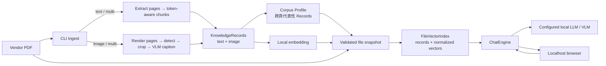
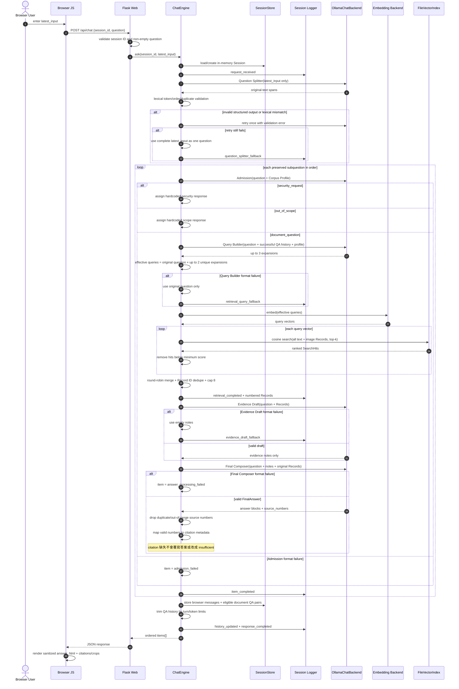
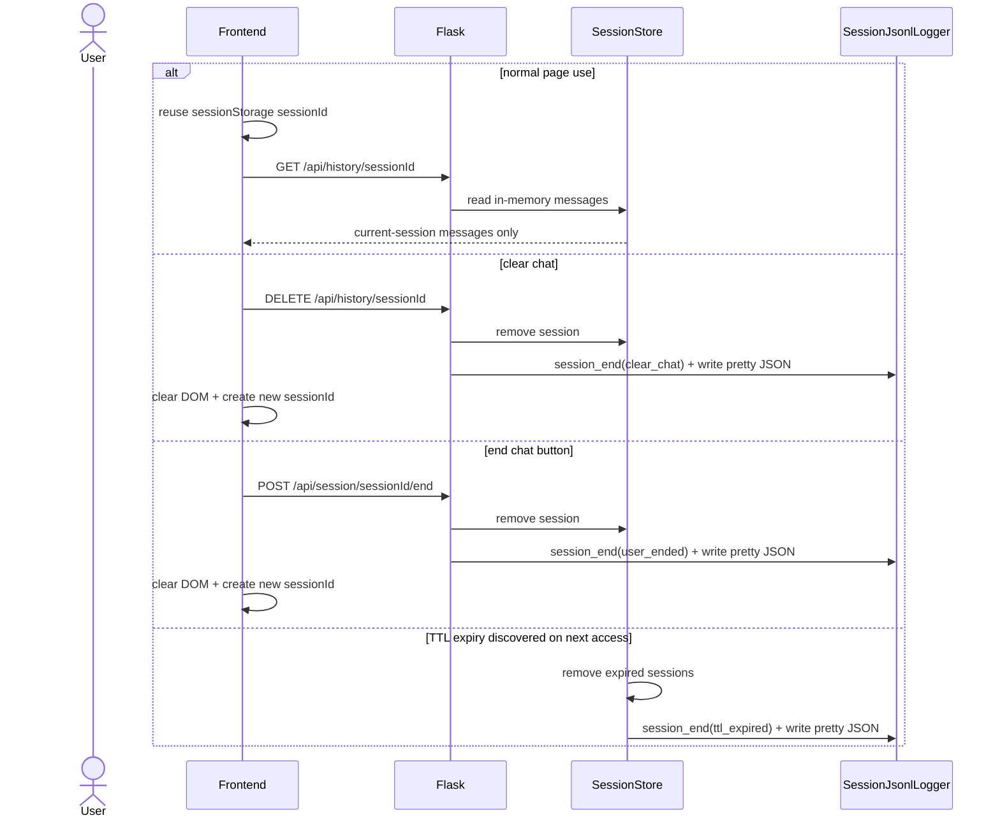
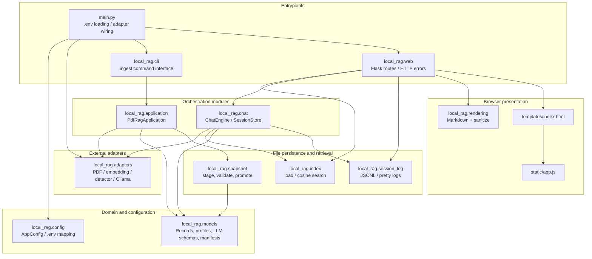

# Local RAG MVP：目前實作流程與模組圖

更新基準：2026-08-06 v3。本文描述目前 active implementation；細部資料契約仍以 `MVP_LOCAL_RAG_SPEC.md` 為準。

## 1. End-to-end pipeline



Snapshot 不使用 Qdrant。`records.jsonl` 與 `embeddings.npy` 依相同列序對應，Chat 啟動時一次載入記憶體進行 cosine retrieval。

## 2. Ingestion sequence

```mermaid
sequenceDiagram
    autonumber
    actor O as Operator
    participant CLI as main.py / CLI
    participant APP as PdfRagApplication
    participant TXT as Text Extractor
    participant IMG as Image Pipeline
    participant VLM as Caption VLM
    participant PROF as Corpus Profile Backend
    participant EMB as Embedding Backend
    participant SNAP as SnapshotWriter
    participant FS as Local Filesystem

    O->>CLI: ingest PDF + mode
    CLI->>APP: ingest(input_pdf, mode)
    APP->>APP: validate mode + hash source PDF

    alt mode = text or multi
        APP->>TXT: extract(PDF)
        TXT-->>APP: ExtractedPage[]
        loop each page
            APP->>APP: chunk by tokenizer count and overlap
            APP->>APP: build text KnowledgeRecords
        end
    end

    alt mode = image or multi
        APP->>IMG: extract(PDF, temporary artifact root)
        Note over IMG: 維持既有 render / detector / crop 呼叫方式
        IMG-->>APP: ImageCandidate[] + crop files
        loop each crop
            APP->>VLM: describe(crop)
            alt caption success
                VLM-->>APP: ImageCaption
                APP->>APP: build searchable image Record
            else unavailable or failed
                APP->>APP: keep crop artifact + warning
                Note over APP: 不建立空 caption 的 image Record
            end
        end
    end

    alt no searchable Records
        APP-->>CLI: fail ingestion
    else Records available
        APP->>PROF: build from evenly sampled Records
        PROF-->>APP: CorpusProfile
        APP->>APP: verify profile document name/hash
        APP->>EMB: embed(all Record.content)
        EMB-->>APP: float32 matrix
        APP->>SNAP: write staged snapshot
        SNAP->>FS: PDF, crops, Records, profile, embeddings, metadata
        SNAP->>SNAP: schema/count/dimension/hash/artifact validation
        alt validation success
            SNAP->>FS: atomically promote stage to index/current
            SNAP-->>CLI: current snapshot path
        else validation failure
            SNAP->>FS: remove incomplete stage; preserve prior current
            SNAP-->>CLI: error
        end
    end
```

### Ingestion 判斷邏輯

| 判斷點 | 目前行為 |
|---|---|
| `text` mode | Text pipeline 失敗即終止；不執行 image pipeline。 |
| `image` mode | 必須提供 image pipeline；image/caption 流程無法產生任何 Record 時終止。 |
| `multi` mode | Text 或 image 單側失敗可記 warning 後繼續；兩側皆無 Record 才終止。 |
| Chunk 上限 | 同時受 `.env` chunk size 與 embedding model token limit 約束；依 tokenizer 實際計數切分。 |
| Caption 失敗 | Crop 可作為 artifact 留存，但不產生不可搜尋的 image Record。 |
| Corpus Profile | 可由 override JSON 提供；否則由最多 `profile_max_records` 筆跨資料序列均勻取樣 Record 建立。 |
| Snapshot promotion | 先寫入 `.stage-*`，完整驗證後才替換 `current`；替換失敗會還原前一份 snapshot。 |

## 3. Chat sequence（active v3）



### Chat 各層判斷邏輯

| 層級 | 輸入 | 判斷與 Backend/LLM 分工 |
|---|---|---|
| Frontend | 使用者文字 | 空字串不送出；`sessionStorage` 保存本分頁 session ID。 |
| Web | `session_id`, `question` | Session ID 僅允許 8–128 位英數、`_`、`-`；問題必須是非空字串。 |
| Splitter LLM | `latest_input` | 只切分原文，不接收 Corpus Profile 或 history。 |
| Splitter Backend | 原文與 spans | 忽略空白及常見分隔符後，token、順序、重複次數必須完全一致；不做語意分類。 |
| Admission LLM | 單一子題、Corpus Profile | 僅輸出 `document_question`、`out_of_scope`、`security_request`。 |
| Admission Backend | category | Security/out-of-scope 直接使用不同 hardcoded 回覆，不進 retrieval。 |
| Query Builder LLM | 子題、profile、成功 QA history | 可補足追問指涉；不得以 profile 或歷史答案取代當前問題。 |
| Query Backend | 原始子題、expansions | 原始子題永遠是 query 1；去重後最多三個 query。 |
| Retrieval | query vectors | 每個 query 搜尋全部 text/image Records；套 score threshold，再 round-robin 去重，最多 8 筆。 |
| Evidence LLM | 問題、編號 Records | 只摘錄事實；失敗時 Backend 使用空 notes，不中止該題。 |
| Final LLM | 問題、notes、Records | 產生 answer blocks 及 1-based `source_numbers`；自行決定文件是否有可回答內容。 |
| Citation Backend | source numbers | 只接受 `1..N`，去除重複／越界編號並映射 Record metadata；不判定語意充分性。 |
| Response | ordered items | `insufficient_context` 為相容欄位，固定 `false`。部分題目失敗仍可 HTTP 200。 |

### 失敗與 HTTP 狀態

| 情況 | 結果 |
|---|---|
| Splitter 兩次皆不合法 | 完整輸入作單一問題，流程繼續。 |
| 單題 Admission 不合法 | 該 item 為 `admission_failed`；其他題繼續。 |
| 全部子題 Admission 失敗 | HTTP 422。 |
| Query Builder 不合法 | 原始子題作唯一 query。 |
| Evidence Draft 不合法 | 空 notes，仍呼叫 Final Composer。 |
| 單題 Final Composer 不合法 | 該 item 為 `answer_processing_failed`；其他題繼續。 |
| 所有 document items 回答處理失敗 | HTTP 502。 |
| Ollama timeout / connection error | HTTP 504 / 503。 |

## 4. Snapshot files and runtime usage

```text
${LOCAL_RAG_INDEX_ROOT}/current/
├─ manifest.json             # snapshot ID、checksum、Record/vector 數量與維度
├─ build_report.json         # ingestion stage 狀態、warnings、artifact locations
├─ corpus_profile.json       # Admission 與 Query Builder 的文件方向描述
├─ records.jsonl             # 正式 retrieval / answer 使用的 KnowledgeRecords
├─ records.pretty.json       # 移除 machine-only 欄位，僅供人工查閱
├─ embeddings.npy            # 與 records.jsonl 同序的 float32 vectors
├─ document/<source.pdf>     # 原始 PDF copy，供前端開啟
└─ crops/<artifact>          # 圖片 citation 顯示用 crop artifacts
```

| Artifact | Chat 中的用途 |
|---|---|
| `records.jsonl` | 載入 `KnowledgeRecord`；retrieval 後將 Record content 交給 Evidence/Final LLM。 |
| `embeddings.npy` | 載入並 normalization；與 query vector 做 cosine similarity。 |
| `corpus_profile.json` | Admission 判定範圍；Query Builder 僅作語意／詞彙消歧。 |
| Source PDF copy | `/api/document` 回傳給瀏覽器；不直接送進每次 Chat。 |
| Crop artifacts | Image Record 被引用時透過 `/api/crops/<record_id>` 顯示；路徑必須仍位於 snapshot。 |
| `records.pretty.json` | 人工除錯用，不參與正式 retrieval。 |

`FileVectorIndex.representative()` 仍存在於 package 中，但目前 active Chat flow 不呼叫；Chat 只使用 `search()`。

## 5. Session、Frontend 與 logging



- `messages` 保存目前分頁可見的 user/assistant items；只存在 Backend memory，重啟或清除後消失。
- `qa_history` 只加入成功的 `document_question + final answer`，提供後續 Query Builder；fixed/error items 不加入。
- History 依 `history_max_turns` 與 `history_max_tokens` 截短。
- 每個 LLM stage、query embedding、retrieval、fallback、citation mapping、response 都先逐行寫入 `{datetime}.jsonl`。
- 清除、結束或 TTL expiry 時，產生同名 `{datetime}.pretty.json`，移除 ID、hash、crop URL 等 machine-only 欄位。
- 前端優先顯示 Backend 已經 Markdown render 並由 `bleach` sanitize 的 `answer_html`；citation metadata 由前端另行排版。

## 6. Package diagram



### 主要 seams

- `PdfRagApplication.ingest()`：CLI ingestion 的高階 seam；內部隱藏 text/image、profile、embedding 與 snapshot orchestration。
- `ChatEngine.ask()`：HTTP chat 的高階 seam；內部隱藏拆題、Admission、RAG、回答、history 與 logging。
- Protocol adapters：`TextExtractor`、`EmbeddingBackend`、`ImagePipeline`、`CaptionBackend`、`CorpusProfileBackend`、`ChatBackend`，可替換 fake 或本機實作。
- `FileVectorIndex.load/search()`：validated snapshot 與 in-memory retrieval 的 seam。

## 7. Local HTTP interface

| Method/path | 用途 |
|---|---|
| `GET /` | Localhost chat UI。 |
| `GET /api/health` | 檢查設定、snapshot、embedding 與 LLM readiness。 |
| `POST /api/chat` | 送出本次問題；回傳 ordered `items[]`。 |
| `GET /api/history/<session_id>` | 取得目前 in-memory browser history。 |
| `DELETE /api/history/<session_id>` | 清除 session 並輸出結束 log。 |
| `POST /api/session/<session_id>/end` | 使用者主動結束對話並 pretty log。 |
| `GET /api/document` | 開啟 snapshot 中唯一的原始 PDF。 |
| `GET /api/crops/<record_id>` | 回傳被引用 Image Record 的 crop artifact。 |
