以下依照目前這份實作流程拆成：

1. **Overview**：各模組作為黑盒，只顯示 I/O。
2. **Submodules**：展開 Splitter、Admission、Query Builder、Retrieval、Evidence Draft、Final Composer、Session 等內部流程。

# 1. Overall Chat Architecture

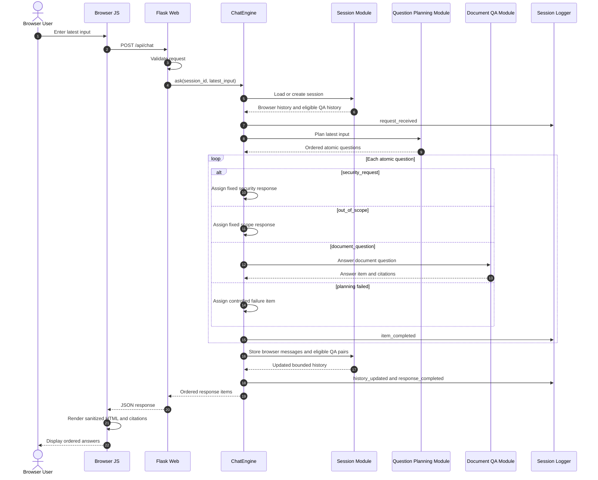
```mermaid
sequenceDiagram
    autonumber
    actor U as Browser User
    participant FE as Browser JS
    participant WEB as Flask Web
    participant CE as ChatEngine
    participant SS as Session Module
    participant PLAN as Question Planning Module
    participant QA as Document QA Module
    participant LOG as Session Logger

    U->>FE: Enter latest input
    FE->>WEB: POST /api/chat

    WEB->>WEB: Validate request
    WEB->>CE: ask(session_id, latest_input)

    CE->>SS: Load or create session
    SS-->>CE: Browser history and eligible QA history
    CE->>LOG: request_received

    CE->>PLAN: Plan latest input
    PLAN-->>CE: Ordered atomic questions

    loop Each atomic question
        alt security_request
            CE->>CE: Assign fixed security response
        else out_of_scope
            CE->>CE: Assign fixed scope response
        else document_question
            CE->>QA: Answer document question
            QA-->>CE: Answer item and citations
        else planning failed
            CE->>CE: Assign controlled failure item
        end

        CE->>LOG: item_completed
    end

    CE->>SS: Store browser messages and eligible QA pairs
    SS-->>CE: Updated bounded history

    CE->>LOG: history_updated and response_completed
    CE-->>WEB: Ordered response items
    WEB-->>FE: JSON response
    FE->>FE: Render sanitized HTML and citations
    FE-->>U: Display ordered answers
```

---

# 2. Flask Request Module

**Input**

* `session_id`
* `question`

**Output**

* Validated request，或 controlled client error

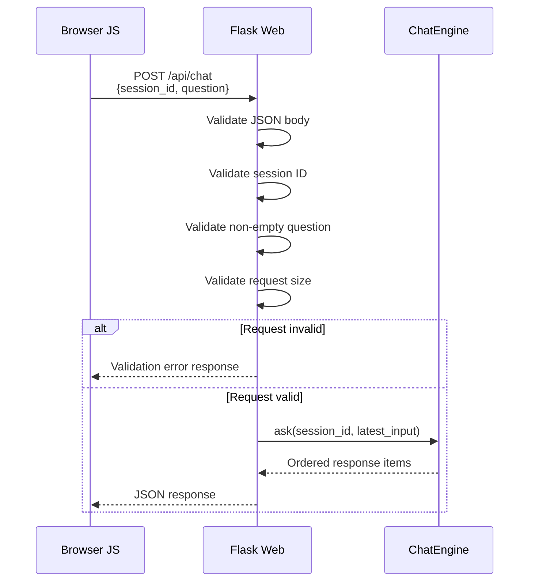
```mermaid
sequenceDiagram
    participant FE as Browser JS
    participant WEB as Flask Web
    participant CE as ChatEngine

    FE->>WEB: POST /api/chat<br/>{session_id, question}

    WEB->>WEB: Validate JSON body
    WEB->>WEB: Validate session ID
    WEB->>WEB: Validate non-empty question
    WEB->>WEB: Validate request size

    alt Request invalid
        WEB-->>FE: Validation error response
    else Request valid
        WEB->>CE: ask(session_id, latest_input)
        CE-->>WEB: Ordered response items
        WEB-->>FE: JSON response
    end
```

---

# 3. Session Module

**Input**

* `session_id`
* New browser messages
* Successful document QA pairs

**Output**

* In-memory Session
* Bounded QA history

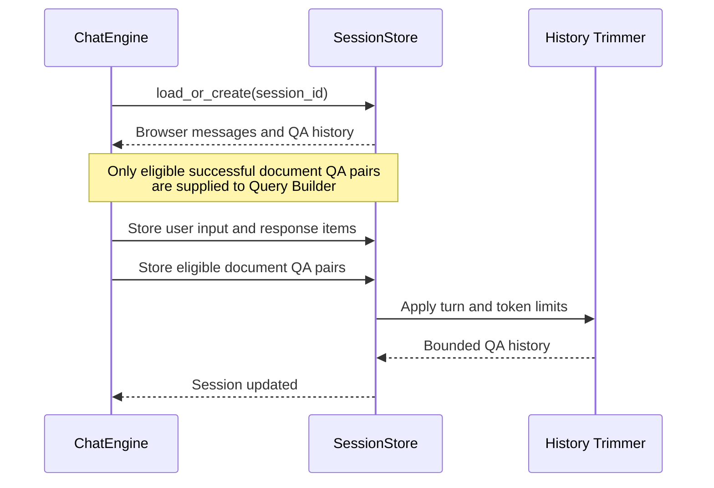
```mermaid
sequenceDiagram
    participant CE as ChatEngine
    participant SS as SessionStore
    participant Trim as History Trimmer

    CE->>SS: load_or_create(session_id)
    SS-->>CE: Browser messages and QA history

    Note over CE,SS: Only eligible successful document QA pairs<br/>are supplied to Query Builder

    CE->>SS: Store user input and response items
    CE->>SS: Store eligible document QA pairs

    SS->>Trim: Apply turn and token limits
    Trim-->>SS: Bounded QA history

    SS-->>CE: Session updated
```

---

# 4. Question Planning Module

此模組負責：

1. 切分多題輸入。
2. 保留原始題目順序與字面內容。
3. 對每一題進行 Admission routing。

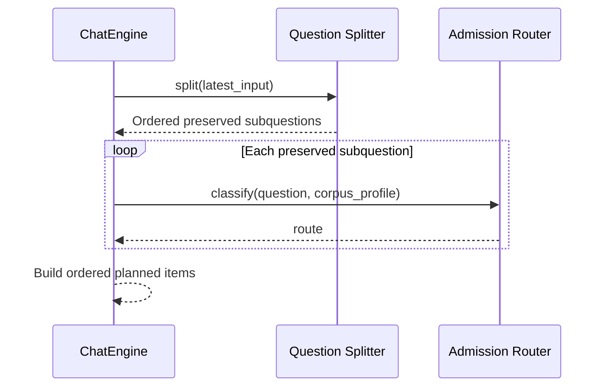
```mermaid
sequenceDiagram
    participant CE as ChatEngine
    participant Split as Question Splitter
    participant Admission as Admission Router

    CE->>Split: split(latest_input)
    Split-->>CE: Ordered preserved subquestions

    loop Each preserved subquestion
        CE->>Admission: classify(question, corpus_profile)
        Admission-->>CE: route
    end

    CE-->>CE: Build ordered planned items
```

---

# 5. Question Splitter Module

**Input**

* 僅使用 `latest_input`

**Output**

* 保留原文的 ordered question spans
* 若格式持續失敗，退回完整輸入作為單一問題

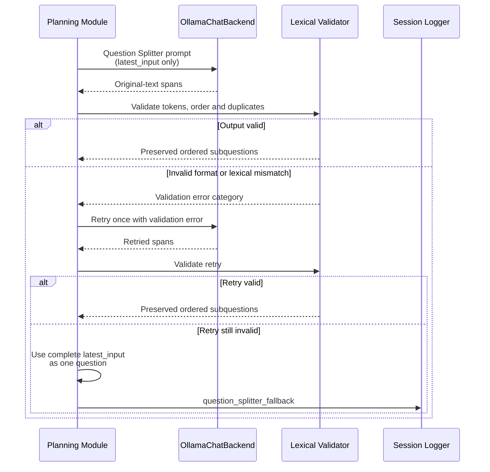
```mermaid
sequenceDiagram
    participant PLAN as Planning Module
    participant LLM as OllamaChatBackend
    participant VAL as Lexical Validator
    participant LOG as Session Logger

    PLAN->>LLM: Question Splitter prompt<br/>(latest_input only)
    LLM-->>PLAN: Original-text spans

    PLAN->>VAL: Validate tokens, order and duplicates

    alt Output valid
        VAL-->>PLAN: Preserved ordered subquestions
    else Invalid format or lexical mismatch
        VAL-->>PLAN: Validation error category
        PLAN->>LLM: Retry once with validation error
        LLM-->>PLAN: Retried spans
        PLAN->>VAL: Validate retry

        alt Retry valid
            VAL-->>PLAN: Preserved ordered subquestions
        else Retry still invalid
            PLAN->>PLAN: Use complete latest_input<br/>as one question
            PLAN->>LOG: question_splitter_fallback
        end
    end
```

---

# 6. Admission Module

**Input**

* Atomic question
* Corpus Profile

**Output**

* `security_request`
* `out_of_scope`
* `document_question`
* `admission_failed`

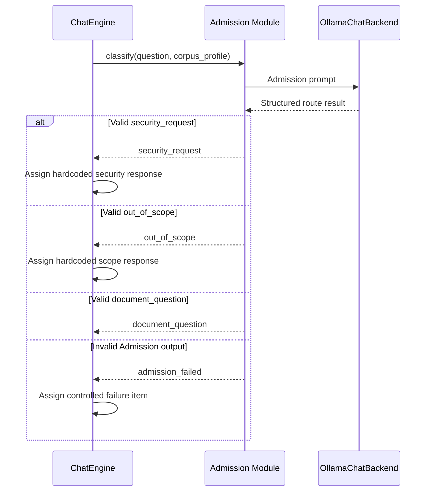
```mermaid
sequenceDiagram
    participant CE as ChatEngine
    participant ADM as Admission Module
    participant LLM as OllamaChatBackend

    CE->>ADM: classify(question, corpus_profile)
    ADM->>LLM: Admission prompt
    LLM-->>ADM: Structured route result

    alt Valid security_request
        ADM-->>CE: security_request
        CE->>CE: Assign hardcoded security response
    else Valid out_of_scope
        ADM-->>CE: out_of_scope
        CE->>CE: Assign hardcoded scope response
    else Valid document_question
        ADM-->>CE: document_question
    else Invalid Admission output
        ADM-->>CE: admission_failed
        CE->>CE: Assign controlled failure item
    end
```

---

# 7. Document QA Module

這是文件問答的主要黑盒，內含：

* Query Builder
* Embedding and retrieval
* Evidence Draft
* Final Composer
* Citation mapping

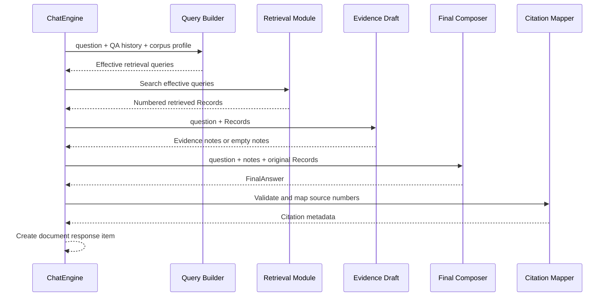
```mermaid
sequenceDiagram
    participant CE as ChatEngine
    participant QB as Query Builder
    participant RET as Retrieval Module
    participant ED as Evidence Draft
    participant FC as Final Composer
    participant CIT as Citation Mapper

    CE->>QB: question + QA history + corpus profile
    QB-->>CE: Effective retrieval queries

    CE->>RET: Search effective queries
    RET-->>CE: Numbered retrieved Records

    CE->>ED: question + Records
    ED-->>CE: Evidence notes or empty notes

    CE->>FC: question + notes + original Records
    FC-->>CE: FinalAnswer

    CE->>CIT: Validate and map source numbers
    CIT-->>CE: Citation metadata

    CE-->>CE: Create document response item
```

---

# 8. Query Builder Module

**Input**

* Current atomic question
* Successful QA history
* Corpus Profile

**Output**

* Original question
* 最多兩個 unique expansions
* 格式失敗時只保留原問題

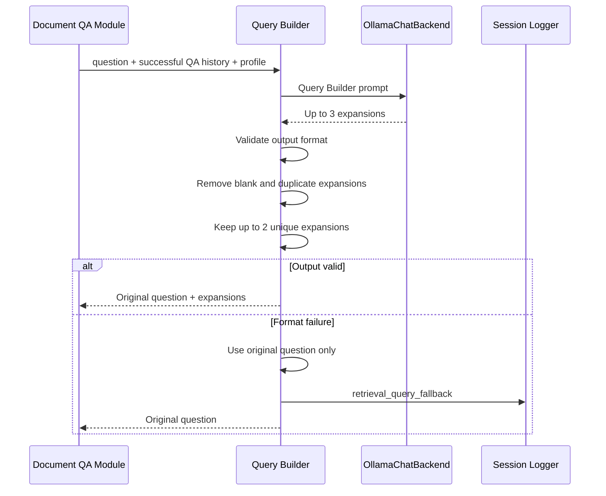
```mermaid
sequenceDiagram
    participant QA as Document QA Module
    participant QB as Query Builder
    participant LLM as OllamaChatBackend
    participant LOG as Session Logger

    QA->>QB: question + successful QA history + profile
    QB->>LLM: Query Builder prompt
    LLM-->>QB: Up to 3 expansions

    QB->>QB: Validate output format
    QB->>QB: Remove blank and duplicate expansions
    QB->>QB: Keep up to 2 unique expansions

    alt Output valid
        QB-->>QA: Original question + expansions
    else Format failure
        QB->>QB: Use original question only
        QB->>LOG: retrieval_query_fallback
        QB-->>QA: Original question
    end
```

---

# 9. Retrieval Module

**Input**

* 1–3 effective queries

**Output**

* 最多八筆去重後的 numbered Records
* 每筆包含 Record ID、modality、score 與 source metadata

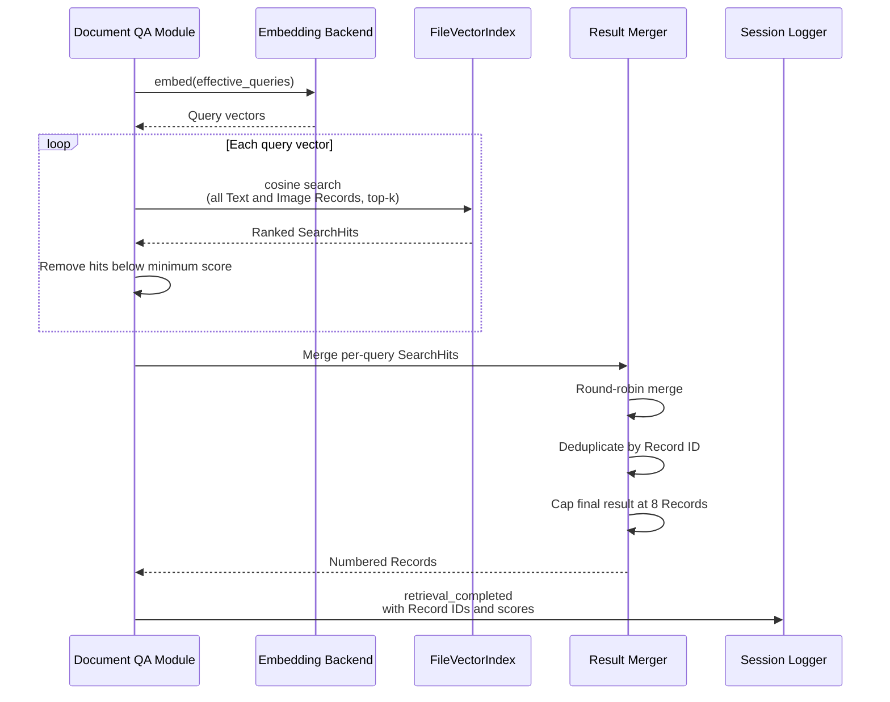
```mermaid
sequenceDiagram
    participant QA as Document QA Module
    participant EMB as Embedding Backend
    participant IDX as FileVectorIndex
    participant Merge as Result Merger
    participant LOG as Session Logger

    QA->>EMB: embed(effective_queries)
    EMB-->>QA: Query vectors

    loop Each query vector
        QA->>IDX: cosine search<br/>(all Text and Image Records, top-k)
        IDX-->>QA: Ranked SearchHits
        QA->>QA: Remove hits below minimum score
    end

    QA->>Merge: Merge per-query SearchHits
    Merge->>Merge: Round-robin merge
    Merge->>Merge: Deduplicate by Record ID
    Merge->>Merge: Cap final result at 8 Records
    Merge-->>QA: Numbered Records

    QA->>LOG: retrieval_completed<br/>with Record IDs and scores
```

---

# 10. Evidence Draft Module

**Input**

* Atomic question
* Retrieved numbered Records

**Output**

* Evidence notes only
* 格式失敗時使用空 notes，不中止整輪問答

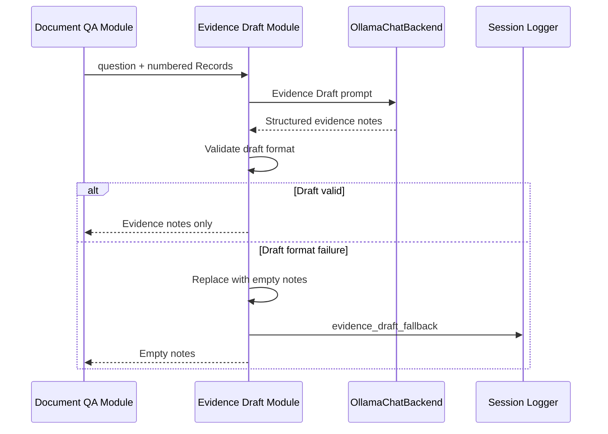
```mermaid
sequenceDiagram
    participant QA as Document QA Module
    participant ED as Evidence Draft Module
    participant LLM as OllamaChatBackend
    participant LOG as Session Logger

    QA->>ED: question + numbered Records
    ED->>LLM: Evidence Draft prompt
    LLM-->>ED: Structured evidence notes

    ED->>ED: Validate draft format

    alt Draft valid
        ED-->>QA: Evidence notes only
    else Draft format failure
        ED->>ED: Replace with empty notes
        ED->>LOG: evidence_draft_fallback
        ED-->>QA: Empty notes
    end
```

---

# 11. Final Composer Module

**Input**

* Atomic question
* Evidence notes
* Original numbered Records

**Output**

* Answer blocks
* `source_numbers`
* 格式失敗時回傳 `answer_processing_failed`

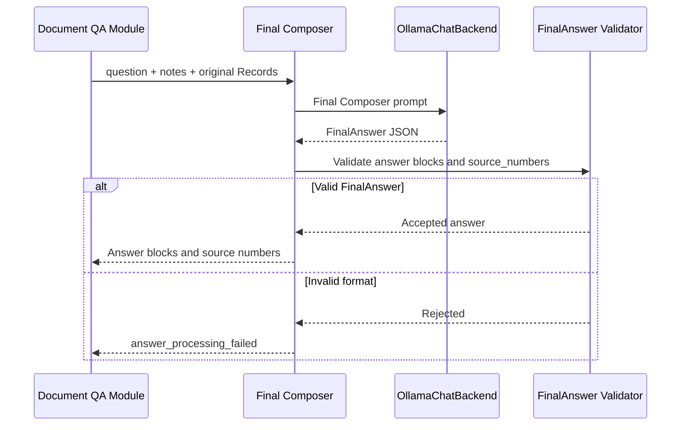
```mermaid
sequenceDiagram
    participant QA as Document QA Module
    participant FC as Final Composer
    participant LLM as OllamaChatBackend
    participant VAL as FinalAnswer Validator

    QA->>FC: question + notes + original Records
    FC->>LLM: Final Composer prompt
    LLM-->>FC: FinalAnswer JSON

    FC->>VAL: Validate answer blocks and source_numbers

    alt Valid FinalAnswer
        VAL-->>FC: Accepted answer
        FC-->>QA: Answer blocks and source numbers
    else Invalid format
        VAL-->>FC: Rejected
        FC-->>QA: answer_processing_failed
    end
```

---

# 12. Citation Mapping Module

此版本的特殊規則是：

> Citation 缺失或部分 citation 無效時，不會覆寫答案，也不會自動改成 insufficient。

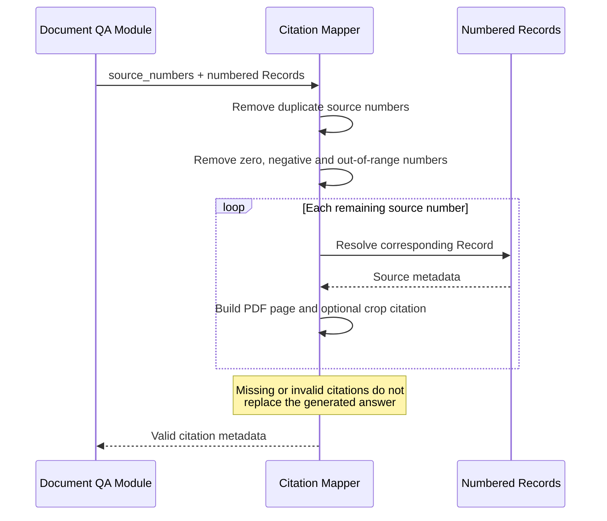
```mermaid
sequenceDiagram
    participant QA as Document QA Module
    participant CIT as Citation Mapper
    participant Records as Numbered Records

    QA->>CIT: source_numbers + numbered Records

    CIT->>CIT: Remove duplicate source numbers
    CIT->>CIT: Remove zero, negative and out-of-range numbers

    loop Each remaining source number
        CIT->>Records: Resolve corresponding Record
        Records-->>CIT: Source metadata
        CIT->>CIT: Build PDF page and optional crop citation
    end

    Note over CIT: Missing or invalid citations do not<br/>replace the generated answer

    CIT-->>QA: Valid citation metadata
```

---

# 13. Response Rendering Module

**Input**

* Answer text or fixed response
* Citation metadata
* Crop references

**Output**

* Sanitized `answer_html`
* Structured citations

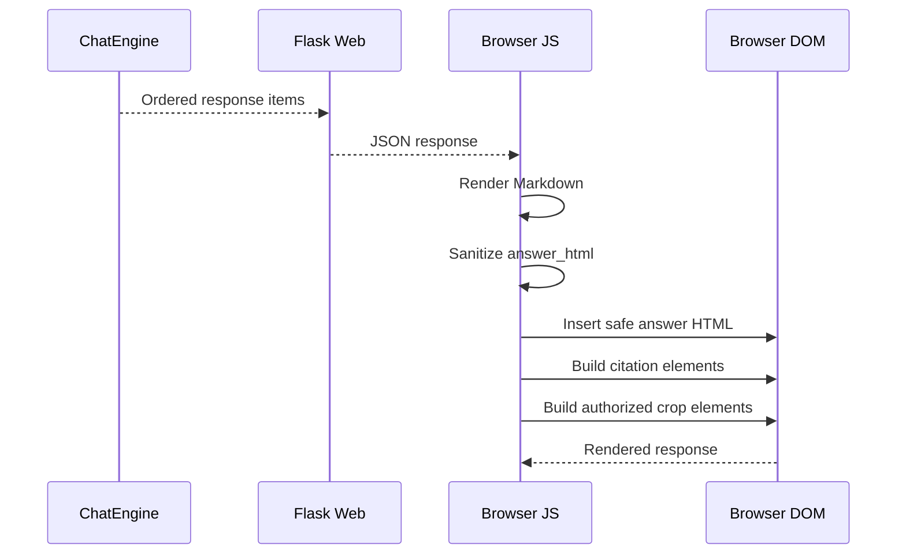
```mermaid
sequenceDiagram
    participant CE as ChatEngine
    participant WEB as Flask Web
    participant FE as Browser JS
    participant DOM as Browser DOM

    CE-->>WEB: Ordered response items
    WEB-->>FE: JSON response

    FE->>FE: Render Markdown
    FE->>FE: Sanitize answer_html
    FE->>DOM: Insert safe answer HTML
    FE->>DOM: Build citation elements
    FE->>DOM: Build authorized crop elements

    DOM-->>FE: Rendered response
```

---

# 14. Logging Module

**Input**

* Request、fallback、retrieval、item、history 與 response events

**Output**

* Session JSONL log

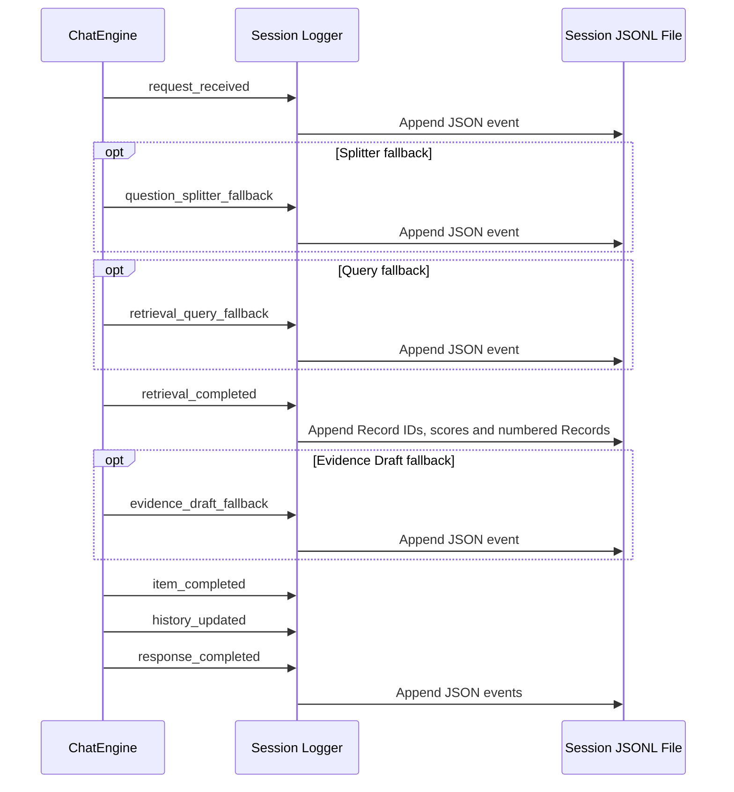
```mermaid
sequenceDiagram
    participant CE as ChatEngine
    participant LOG as Session Logger
    participant File as Session JSONL File

    CE->>LOG: request_received
    LOG->>File: Append JSON event

    opt Splitter fallback
        CE->>LOG: question_splitter_fallback
        LOG->>File: Append JSON event
    end

    opt Query fallback
        CE->>LOG: retrieval_query_fallback
        LOG->>File: Append JSON event
    end

    CE->>LOG: retrieval_completed
    LOG->>File: Append Record IDs, scores and numbered Records

    opt Evidence Draft fallback
        CE->>LOG: evidence_draft_fallback
        LOG->>File: Append JSON event
    end

    CE->>LOG: item_completed
    CE->>LOG: history_updated
    CE->>LOG: response_completed
    LOG->>File: Append JSON events
```

## 模組關係摘要

```text
Flask Web
└─ ChatEngine
   ├─ Session Module
   ├─ Question Planning Module
   │  ├─ Question Splitter
   │  └─ Admission
   ├─ Document QA Module
   │  ├─ Query Builder
   │  ├─ Retrieval
   │  ├─ Evidence Draft
   │  ├─ Final Composer
   │  └─ Citation Mapper
   └─ Session Logger
```

這個拆法保留了目前實作的重要特性，包括 splitter lexical validation、Admission 分流、多 query round-robin retrieval、Evidence Draft fallback，以及 citation 缺失不會推翻答案的現行規則。
